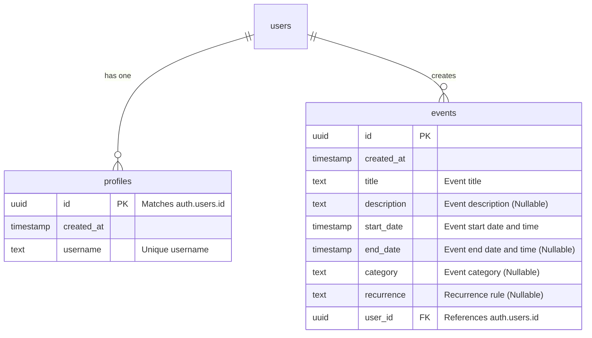

# Smart Scheduling


A modern, responsive, and dynamic Event Scheduling application built with React, Vite, TypeScript, and Supabase. The application allows users to manage their events seamlessly, featuring an intuitive calendar interface, categorical filtering, search functionality, and secure authentication.

## Features

- **User Authentication:** Secure signup and login using Supabase Auth.
- **Guest Mode:** Experience the app without creating an account (events are stored in-memory).
- **Interactive Calendar:** Visual event calendar for easy date selection and event viewing.
- **Event Management:** Add, edit, and delete events with details like title, description, category, and date.
- **Advanced Filtering & Search:** Search events by keyword and filter them by custom categories.
- **Responsive Design:** Fully responsive UI built with Tailwind CSS and Shadcn UI components.
- **Real-time Toasts:** Instant feedback on user actions using Sonner.

## Tech Stack

- **Frontend Framework:** React 18, Vite
- **Language:** TypeScript
- **Styling:** Tailwind CSS, Shadcn UI
- **State Management:** React Query (@tanstack/react-query), React Hooks
- **Routing:** React Router DOM
- **Backend & Database:** Supabase (PostgreSQL, Auth, Row Level Security)

## Database Architecture

The application uses PostgreSQL (via Supabase) with the following core schema:



*Note: The `users` table is managed internally by Supabase Auth (`auth.users`), and `profiles` and `events` inherit their `id` and `user_id` relations accordingly.*

## Getting Started

Follow these instructions to set up the project locally.

### Prerequisites

Ensure you have the following installed on your local machine:
- Node.js (v18 or higher)
- npm or yarn or bun

### Installation

1. **Clone the repository:**
   ```bash
   git clone <repository-url>
   cd Smart-Scheduling
   ```

2. **Install dependencies:**
   ```bash
   npm install
   # or
   bun install
   ```

3. **Set up Environment Variables:**
   Create a `.env` file in the root of your project and add your Supabase credentials. You can find these in your Supabase project settings under API.

   ```env
   VITE_SUPABASE_URL=your_supabase_project_url
   VITE_SUPABASE_ANON_KEY=your_supabase_anon_key
   ```

4. **Start the Development Server:**
   ```bash
   npm run dev
   # or
   bun run dev
   ```

5. **Open your browser:**
   Navigate to `http://localhost:5173` to see the application running.

## Project Structure

```text
Smart-Scheduling/
├── public/                 # Static assets
├── src/                    # Source code
│   ├── components/         # Reusable React components (UI & layout)
│   ├── hooks/              # Custom React hooks
│   ├── integrations/       # External service integrations (Supabase client & types)
│   ├── lib/                # Utility functions
│   ├── pages/              # Main application pages (Index, Login, Signup)
│   ├── types/              # TypeScript definitions
│   ├── App.tsx             # Root application component and routing setup
│   ├── main.tsx            # Application entry point
│   └── index.css           # Global stylesheets (Tailwind)
├── supabase/               # Supabase configuration and metadata
├── package.json            # Project metadata and scripts
├── tailwind.config.ts      # Tailwind CSS configuration
├── tsconfig.json           # TypeScript configuration
└── vite.config.ts          # Vite configuration
```

